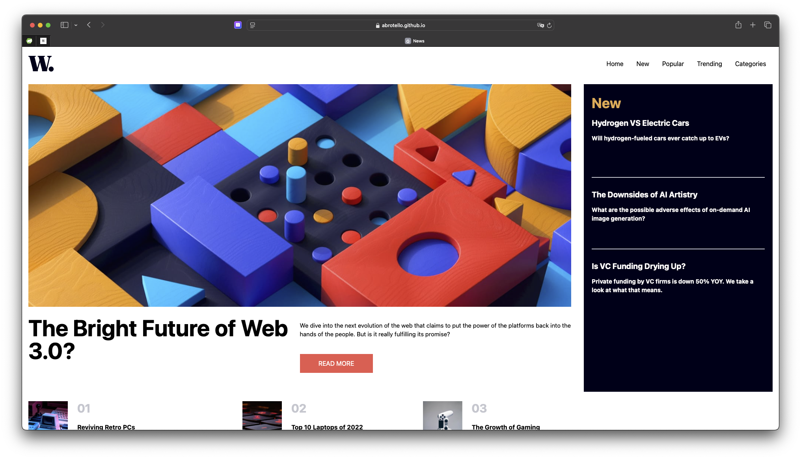

# 🗞️ W-News - Página Estática

Este proyecto es una **página de noticias estática** construida con **React**, **TailwindCSS** y **Vite**. Está optimizada para ser **responsive**.

---

## 🚀 Tecnologías utilizadas

- ⚛️ [React](https://react.dev/)
- 🎨 [TailwindCSS](https://tailwindcss.com/)
- ⚡ [Vite](https://vitejs.dev/)

---

## 🔗 Demo en vivo

👉 [Ver en GitHub Pages](https://abrotello.github.io/W-News/)

## 📸 Vista previa

---
